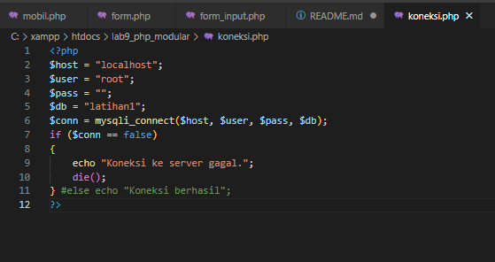
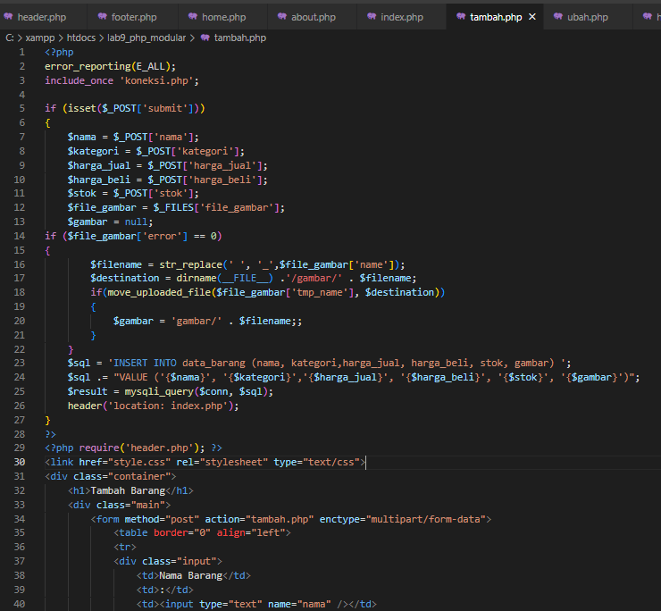
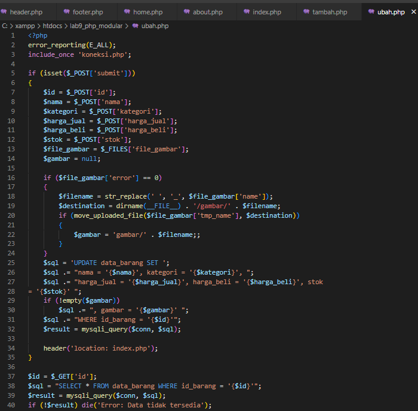

# Lab9Web
## Praktikum 9 PHP Modular
Membuat folder baru dengan nama lab9_php_modular pada docroot webserver (htdocs)
### Header.php
Membuat file baru dengan nama `header.php` contoh codingan nya seperti gambar berikut ini :

### Footer.php 
Membuat file `footer.php` contohnya seperti berikut ini :

### Home.php
Membuat file `home.php` contohnya seperti berikut ini :

### About.php
Membuat file `about.php` dedngan contoh codingan seperti ini :

Buka melalui Browser dengan alamat `http://localhost/lab9_php_modular/home.php` maka tampilan di Browser akan seperti ini :

## Pertanyaan dan Tugas
Implementasikan konsep modularisasi pada kode program praktikum 8 tentang database, sehingga setiap halamannya memiliki template tampilan yang sama.

### Membuat Koneksi ke Database
Buat file dengan nama `koneksi.php` seperti gambar dibawah ini :

Buka melalui Browser untuk menguji apakah sudah terkoneksi ke Database atau belum 

### Header.php
Membuat file `header.php` seperti gambar berikut ini :

### Footer.php
Membuat file `footer.php` seperti gambar berikut ini :

### Menampilkan Data (Read)
Membuat file `index.php` untuk menampilkan data atau Read database, codingan nya seperti gambar dibawah ini :

### Menambahkan Data (Creat)
Selanjutnya buat file dengan nama `tambah.php` untuk menambahkan data yang akan masuk ke dalam Database

### Mengubah Data (Update)
Buat file baru dengan nama `ubah.php` untuk mengubah barang. Contoh nya seperti gambar dibawah ini :

### Menghapus Barang (Delete)
Membuat file dengan nama `hapus.php` untuk menghapus data barang. Contoh nya seperti gambar di bawah ini :

### Deklarasi CSS 

Buat file dengan nama `style.css` untuk mengubah tampilan WEB agar lebih menarik. Contoh nya seperti ini :

TERIMA KASIH!!!
